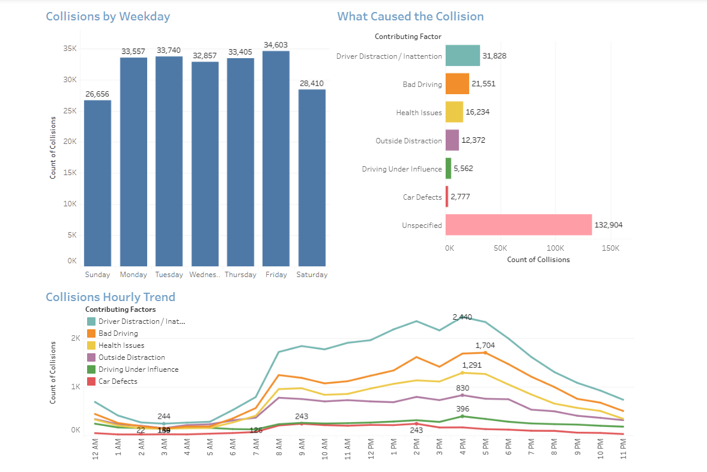
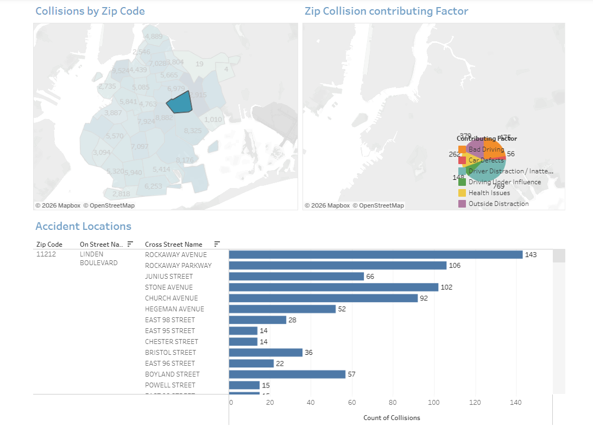
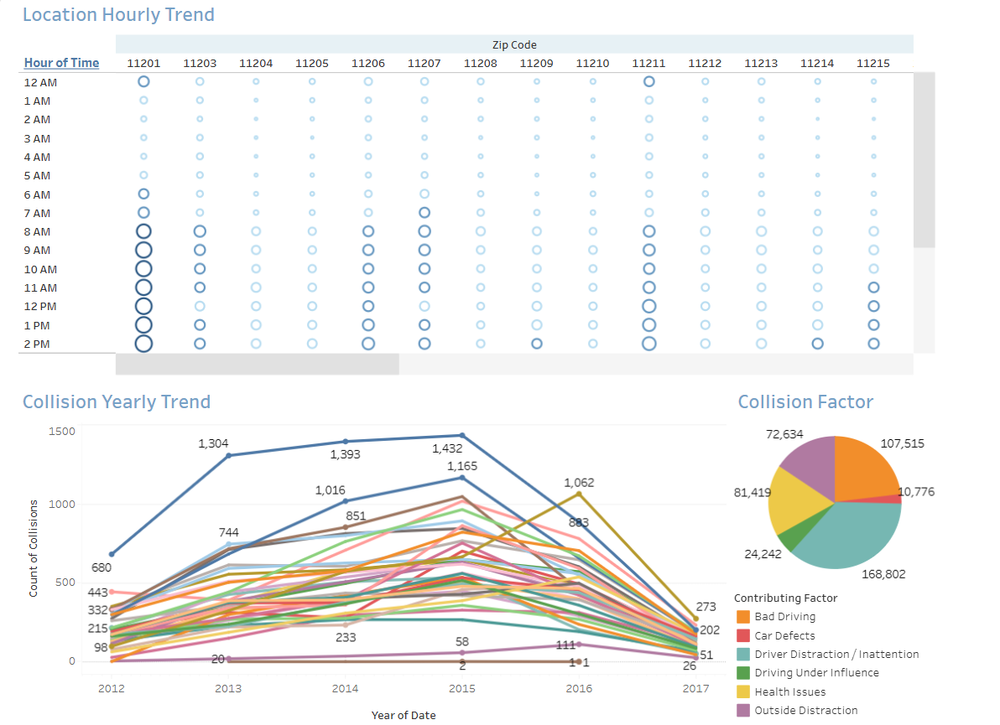
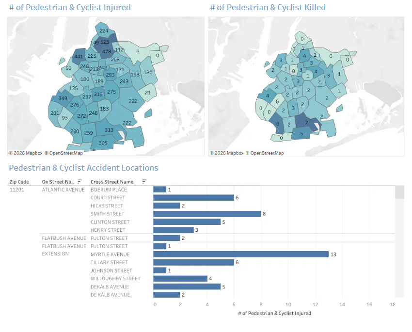

# New York Motor Vehicle Collision Analysis

This project analyzes motor vehicle collision data from New York City using Tableau. The analysis focuses on understanding when collisions happen, where they are concentrated, the major factors behind them, and areas with higher pedestrian and cyclist risk.

The detailed dashboard analysis focuses on Brooklyn.

## Tableau Dashboard

[View the interactive Tableau dashboard](https://public.tableau.com/shared/W7KMRQ3JG?:display_count=n&:origin=viz_share_link)

## Dataset

- Dataset: NYC Motor Vehicle Collision Data
- Records: 993,930
- Date Range: July 2012 - March 2017
- Main Analysis Area: Brooklyn, New York

## Tools Used

- Tableau
- Google BigQuery
- Excel

## What I Analyzed

The project looks at:

- Collisions by weekday
- Collisions by time of day
- Major contributing factors
- Collisions by ZIP code
- Collision locations and intersections
- Hourly collision trends by location
- Pedestrian and cyclist injuries and deaths
- Yearly collision trends

## Data Preparation

The dataset contained 48 different contributing factors. To make the analysis easier to understand, they were grouped into six categories:

- Driver Distraction / Inattention
- Bad Driving
- Health Issues
- Outside Distraction
- Driving Under Influence
- Car Defects

Contributing-factor fields for vehicles 2-5 were not included in the main analysis because many of the values were unspecified or null.

Unspecified and null values were also excluded from the primary contributing-factor analysis.

## Dashboard 1: Contributing Factors and Time of Day

This dashboard looks at collision patterns across weekdays, contributing factors, and hours of the day.

Some of the main findings were:

- Saturday and Sunday had lower collision volumes than most weekdays.
- Driver Distraction / Inattention was the largest contributing-factor group.
- Collision activity was highest during the late afternoon, especially around 3 PM to 6 PM.

## Dashboard 2: Collisions by Location

This dashboard analyzes collisions by ZIP code and allows the data to be explored at the street and intersection level.

ZIP code 11201 was identified as one of the areas with a high number of collisions.

## Dashboard 3: Location Hourly Trend

Collision patterns were also analyzed by ZIP code and hour of day.

This makes it possible to identify locations where collision patterns differ depending on the time of day. For example, ZIP code 11213 showed comparatively higher collision activity during some late-night hours.

## Dashboard 4: Pedestrian and Cyclist Analysis

This dashboard focuses on pedestrian and cyclist injuries and deaths.

ZIP code 11206 was identified as one of the areas that stood out in this analysis. The dashboard can also be used to examine streets and intersections within higher-risk areas.

## Recommendations

Based on the analysis:

- Focus distracted-driving awareness efforts on high-risk periods.
- Increase traffic monitoring during peak collision hours.
- Pay closer attention to high-collision ZIP codes and intersections.
- Use hourly collision patterns to help decide where traffic enforcement may be needed at different times.
- Increase DUI checks in areas showing higher late-night DUI-related collisions.
- Improve pedestrian crossings, cycling infrastructure, traffic signals, and signs in higher-risk areas.

## Tableau Workbook

The Tableau packaged workbook used for this project is included in this repository:

`NYC_Motor_Vehicle_Collision_Analysis.twbx`
